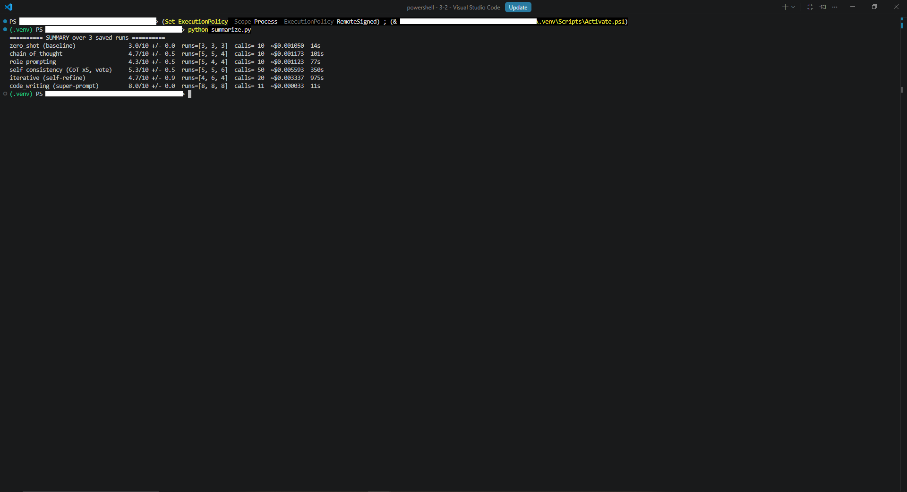
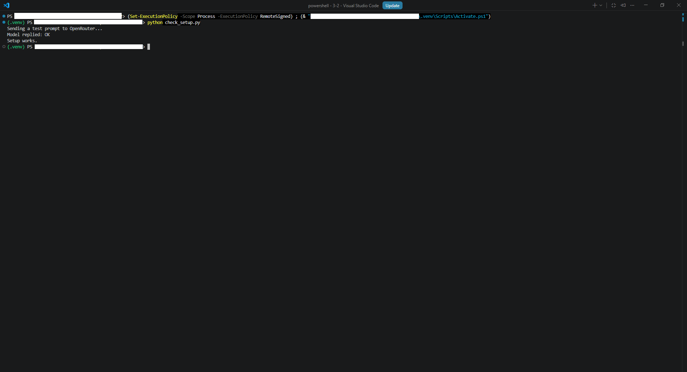
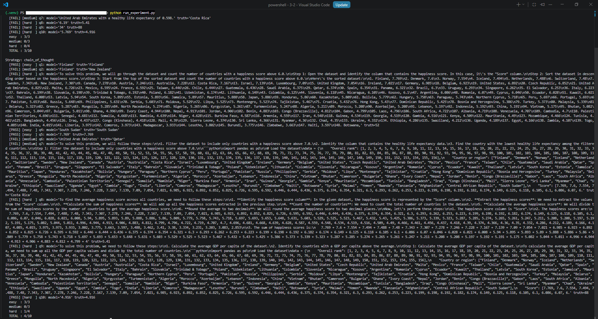
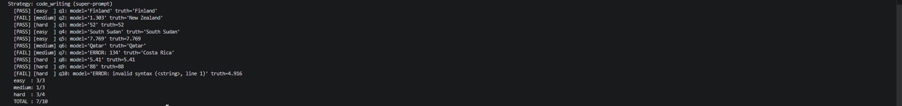

# Prompt-Strategy-Lab – Comparing Six Prompting Strategies on a Data-Analysis Task

A controlled experiment that runs six prompting strategies against the same data-analysis task and measures their accuracy, reliability, and cost. The headline result: making the model write code that Python executes beats every text-based prompting strategy at once – on accuracy, stability, and cost.

## Overview

Most demonstrations of prompt engineering show one clever prompt and a good-looking answer. This project asks a sharper question: on a fixed task and a fixed model, which prompting strategy actually performs best, and why? Six strategies – zero-shot, chain-of-thought, role prompting, self-consistency, iterative self-refinement, and code-writing – answer the same ten questions about the 2019 World Happiness dataset, ranging from simple lookups to multi-step calculations.

Two ideas hold the project together.

**The model is graded against an objective answer key, not its own judgment.** Every correct value – the highest score, the number of countries above the mean, the median – is computed in Python with pandas first, and the model's answer is compared to it. The evaluation stays exact and repeatable instead of depending on what the model claims about itself.

**The data is a measuring instrument, not the subject.** The happiness dataset was chosen precisely because every answer can be computed exactly, which makes it a fair, objective yardstick for the strategies. The project studies *how the strategies behave*, not the happiness data itself.



## Technologies Used

- **Python 3.11** – core language
- **Requests** – calls to the OpenRouter API
- **pandas** – the dataset, the answer key, and the executed code
- **python-dotenv** – API key management
- **OpenRouter** – single gateway to the language model (Llama 3.1 8B Instruct)
- **VS Code** – development environment

## Setup

### Requirements

- Python 3.11 or newer
- An OpenRouter API key (free key available at openrouter.ai)

### Install

```powershell
py -3.11 -m venv .venv
.venv\Scripts\activate
pip install -r requirements.txt
```

### Add your API key

Create a `.env` file in the project root:

```
OPENROUTER_API_KEY=your-openrouter-api-key-here
```

`.env` is listed in `.gitignore`, so the key never reaches the repository.

### Add the data

The dataset is not committed to the repository (it is externally licensed and
available directly from Kaggle). Download `2019.csv` from the
[World Happiness 2019](https://www.kaggle.com/datasets/unsdsn/world-happiness)
dataset by the UN Sustainable Development Solutions Network, create a `data/`
folder in the project root, and save it as:

```
data/2019.csv
```

### Run

```powershell
python check_setup.py        # quick connectivity test – prints "Setup works."
python run_experiment.py     # runs all six strategies three times, saves results to results/
python summarize.py          # reprints the summary from saved results (no API calls)
```

A quick connectivity check confirms the key and environment work before the full run:



## Project Structure

```
Prompt-Strategy-Lab/
├── src/
│   ├── __init__.py
│   ├── llm_client.py       # OpenRouter client + token-usage accounting
│   ├── dataset.py          # loads the CSV
│   ├── questions.py        # the ten questions + the Python answer key
│   ├── evaluation.py       # answer extraction and grading
│   └── strategies.py       # the prompt-building strategies
├── run_experiment.py       # runs every strategy, repeats, saves results, prints the summary
├── summarize.py            # reprints the summary from saved JSON (no API calls)
├── check_setup.py          # quick API connectivity test
├── data/                   # 2019.csv (Kaggle, gitignored)
├── results/                # timestamped run results (JSON)
├── requirements.txt
├── .env.example
├── .gitignore
└── README.md
```

## The Experiment

Ten questions are asked of each strategy, grouped by difficulty: **easy** (direct lookups, e.g. the happiest country), **medium** (multi-step reasoning, e.g. the lowest GDP among the top ten), and **hard** (arithmetic over all 156 rows, e.g. how many countries are above the average).

For every question, a Python function computes the true answer in advance. Each model reply is graded automatically: the final answer is taken from the first line after an `Answer:` marker and compared to the truth – numbers within a small tolerance, names by exact match. Holding the model and the questions fixed means any difference in the results can be attributed to the **strategy**, not to chance in the task.

## The Six Strategies

- **zero-shot** – asks the question with no extra guidance; fastest, but only handles direct factual questions.
- **chain-of-thought** – asks the model to reason step by step before answering; improves multi-step logic, but not arithmetic.
- **role prompting** – gives the model a role ("you are a data analyst"); raises care slightly, but a persona is not reasoning.
- **self-consistency** – runs chain-of-thought several times and takes the most common answer; smooths out randomness, but costs far more.
- **iterative self-refinement** – the model answers, then reviews and revises its own answer; helps only when the mistake is detectable.
- **code-writing** – the model writes a pandas expression that Python executes; exact on arithmetic, because the code does the math, not the model.

## Results

Each strategy was run three times to expose run-to-run variance. Accuracy is shown as the mean over three runs, with the spread.

| Strategy | Accuracy (3 runs) | Calls | ~Cost | Time |
|---|---|---|---|---|
| zero-shot | 3.0/10 ± 0.0 | 10 | $0.0011 | 14 s |
| chain-of-thought | 4.7/10 ± 0.5 | 10 | $0.0012 | 101 s |
| role prompting | 4.3/10 ± 0.5 | 10 | $0.0011 | 77 s |
| self-consistency | 5.3/10 ± 0.5 | 50 | $0.0056 | 350 s |
| iterative self-refinement | 4.7/10 ± 0.9 | 20 | $0.0033 | 975 s |
| **code-writing** | **8.0/10 ± 0.0** | 11 | **$0.00003** | **11 s** |

A few findings stand out.

**Logic and arithmetic are separate abilities.** Explicit reasoning (chain-of-thought, self-consistency) solves the multi-step *medium* questions, but never breaks the arithmetic ceiling – the *hard* questions stay near one in four for every text strategy. Better prompting improves reasoning; only changing the approach fixes computation.



**Self-correction needs an objective signal.** Iterative self-refinement did not help and sometimes turned a correct answer into a wrong one: with no way to detect its own arithmetic error, the model "revises" blindly. Code-writing succeeds for the opposite reason – a syntax or runtime error is a real signal, so feeding it back and retrying fixes it.


**The best strategy is also the cheapest and most stable.** Code-writing was the only capable strategy whose result did not vary at all across runs (Python computes deterministically), and it was far cheaper because it sends the model only the column names, not the data. The cost ordering is a property of the strategies, not of the price list: the dollar figures above are specific to this model, but the *relative* ranking holds for any model, since it is driven by how much text each strategy sends.



## Key Design Decisions

1. **Python computes the answer key; the model is only measured against it.** The model is never asked whether its own answer is correct – every truth is computed independently in pandas.
2. **The model writes code; Python runs it.** For the winning strategy, the model produces a single pandas expression and Python executes it, so the arithmetic is exact.
3. **Grading takes only the final answer.** The grader reads the first line after `Answer:`, so a long reasoning dump that happens to contain the right word is no longer counted as correct.
4. **Every strategy is repeated three times.** A single run is misleading, because the provider routing introduces variance even at temperature 0; repetition makes that variance visible.
5. **Model-generated code runs in a restricted namespace.** Executed expressions are limited to an explicit allow-list of functions and cannot import modules or open files – a deliberate, scoped demonstration; full isolation in production would use a separate process.
6. **The API key is never in the source.** It is read from `.env`, which is gitignored from the first commit.

## Challenges & Solutions

| Problem | Solution |
|---|---|
| Chain-of-thought reproduced the whole dataset and ran out of response length before answering | Shortened the prompt with a clear instruction not to reprint the data |
| The grader counted a name found inside a reproduced data table as correct | Grade only the first line after the `Answer:` marker |
| Results differed between identical runs | Repeated the suite three times and reported the spread |
| The provider occasionally returned empty content and crashed the run | Retry, and on persistent failure return an empty answer so the experiment continues |
| pandas values could not be written to JSON | Added a converter from numpy types to plain Python types |
| The model sometimes wrote code that failed | Fed the error back and asked for a correction, which stabilised the result |

## Scope and Limitations

- **One model, held constant by design.** All strategies are tested on the same Llama 3.1 8B so that the strategy is the only variable. A small, non-reasoning model was chosen on purpose – a stronger model would answer well regardless of prompt and hide the differences.
- **One dataset and task type.** The findings concern tabular question-answering; other task types could behave differently.
- **Ten questions, three runs.** Enough to show clear trends and variance, but a larger question set and more runs would tighten the estimates.
- **Cost is relative, not absolute.** The dollar figures apply to this model and these rates; the strategy ranking is what generalises.

## Possible Improvements

- Run the same suite across several models to see how strategy effectiveness scales with model capability.
- Add other task types (text reasoning, extraction) to test how far the conclusions generalise.
- Apply error-feedback retrying to *all* code, and explore where automated self-correction does and does not help.
- Replace substring grading with a stricter, model-judge or schema-based check.
- Report accuracy-per-cost directly, and add a larger, systematically generated question set.

## Dataset

This project uses the [World Happiness Report 2019](https://www.kaggle.com/datasets/unsdsn/world-happiness)
dataset by the UN Sustainable Development Solutions Network (SDSN), available on
Kaggle.
it a fair yardstick.

The dataset is not committed to the repository – download it from Kaggle and
place it under `data/` as described in **Add the data** above.
